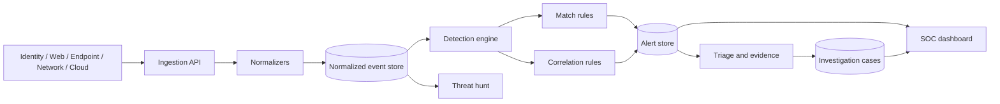

# Arquitetura

## Componentes

| Componente | Responsabilidade |
|---|---|
| `normalizers.js` | Converte formatos de cinco fontes e um formato genérico para o esquema interno. |
| `detection-engine.js` | Executa regras, correlaciona janelas temporais e deduplica fingerprints. |
| `rules.js` | Catálogo versionável das regras e metadados MITRE ATT&CK. |
| `data.js` | Seed sintético e armazenamento substituível usado na demonstração. |
| `server.js` | API HTTP, autorização, validação, auditoria e arquivos estáticos. |
| `public/` | Console operacional sem framework, ligado diretamente à API. |

## Fluxo de uma detecção

1. A API recebe um lote de uma fonte conhecida.
2. Cada evento recebe campos consistentes de tempo, categoria, ação, resultado e entidades.
3. O motor executa regras habilitadas sobre eventos ordenados cronologicamente.
4. Regras de correlação agrupam eventos por usuário, IP ou host em uma janela.
5. Uma fingerprint SHA-256 combina regra, entidades e intervalo horário para evitar alertas duplicados.
6. O alerta preserva IDs das evidências e pode ser promovido a um caso.

## Evolução para produção

- Broker: Kafka, Kinesis ou Pub/Sub para desacoplar ingestão e análise.
- Armazenamento: OpenSearch ou ClickHouse para eventos; PostgreSQL para casos e auditoria.
- Processamento: workers particionados por tenant e regra, com checkpoint e replay.
- Identidade: OIDC, MFA, RBAC persistente e autorização por organização.
- Operação: métricas Prometheus, tracing OpenTelemetry, DLQ e SLO de latência de detecção.

## Threat model resumido

As fronteiras principais são a API de ingestão, o navegador do analista e futuros conectores externos. Os riscos dominantes são eventos maliciosos renderizados como código, exaustão por lotes, adulteração de regras, acesso indevido a evidências e perda de auditoria. Os controles atuais reduzem esses riscos no contexto de demonstração; persistência, identidade forte e isolamento por tenant são requisitos para produção.
